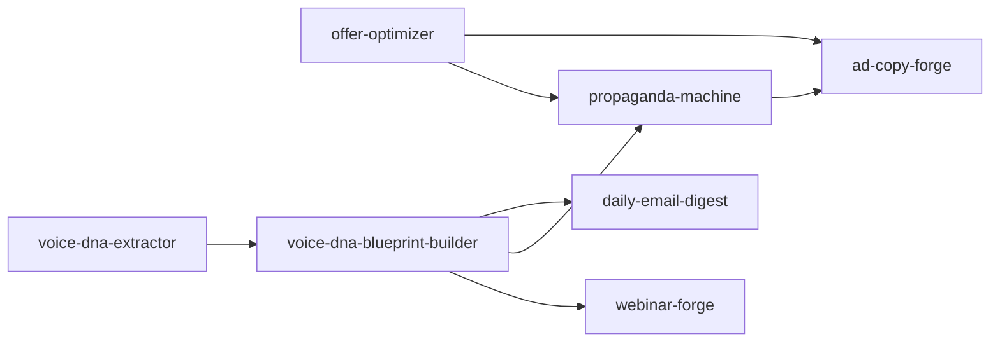

# Dependency Graph

Per PLAN-v3.1 §2.5. Three views: (1) Mermaid DAG of skill→skill dependencies, (2) cross-matrix of prereq class × dep tier, (3) MCP reverse-index for `hermes-doctor` (Phase 2).

## 1. Skill → Skill DAG

Soft dependencies (`recommends:`) are not shown — they cascade noise; see per-skill `plugin.json` for the full list.

## 2. Cross-Matrix (Prereq Class × Dep Tier)

Two orthogonal taxonomies — skill→skill graph tier AND external-prereq class. Both matter for install ordering and `hermes-doctor` (Phase 2).

| Skill | Dep Tier | Prereq Class |
|-------|----------|--------------|
| `ad-copy-forge` | LEAF | Standalone |
| `belief-shift-e-engine` | ROOT | Standalone |
| `charisma-codes` | ROOT | Standalone |
| `council-primer` | ROOT | Standalone |
| `counsel-dispatch` | ROOT | Vault-only |
| `daily-email-digest` | MID | Standalone |
| `exportskill` | ROOT | Standalone |
| `funnel-audit` | ROOT | Vault-only |
| `funnel-hack-lvl-1` | ROOT | Vault-only |
| `funnel-hack-research` | ROOT | Standalone |
| `funnel-translate` | ROOT | Heavy-prereq |
| `headline-creator` | ROOT | Standalone |
| `inbox-digest` | ROOT | Heavy-prereq |
| `learn-eval` | ROOT | Vault-only |
| `magnetic-offer-blueprint` | ROOT | Standalone |
| `morning-compass` | ROOT | Heavy-prereq |
| `offer-optimizer` | ROOT | Heavy-prereq |
| `perplexity-research` | ROOT | Heavy-prereq |
| `power-clip-pro` | ROOT | Standalone |
| `propaganda-machine` | LEAF | Standalone |
| `quicksave` | ROOT | Standalone |
| `quickshare` | ROOT | Standalone |
| `savepoint` | ROOT | Heavy-prereq |
| `skill-to-site` | ROOT | Service-only |
| `ss-ad-generator` | ROOT | Standalone |
| `voice-dna-blueprint-builder` | MID | Standalone |
| `voice-dna-extractor` | ROOT | Heavy-prereq |
| `vsl-activator` | ROOT | Standalone |
| `webinar-forge` | MID | Vault-only |

## 3. MCP Reverse-Index

When an MCP server is down or missing, which skills break? `hermes-doctor` (Phase 2) uses this to answer in O(1).

| MCP Family | Skills That Depend On It |
|------------|--------------------------|
| `mcp__claude_ai_Canva__` | `offer-optimizer` |
| `mcp__composio__` | `morning-compass` |
| `mcp__ffmpeg-mcp__` | `voice-dna-extractor` |
| `mcp__gmail-gong-mcp__` | `inbox-digest` |
| `mcp__obsidian-brain__` | `counsel-dispatch`, `funnel-audit`, `funnel-hack-lvl-1`, `funnel-translate`, `inbox-digest`, `learn-eval`, `morning-compass`, `perplexity-research`, `savepoint`, `webinar-forge` |
| `mcp__perplexity__` | `perplexity-research` |
| `mcp__yt-dlp-mcp__` | `voice-dna-extractor` |
